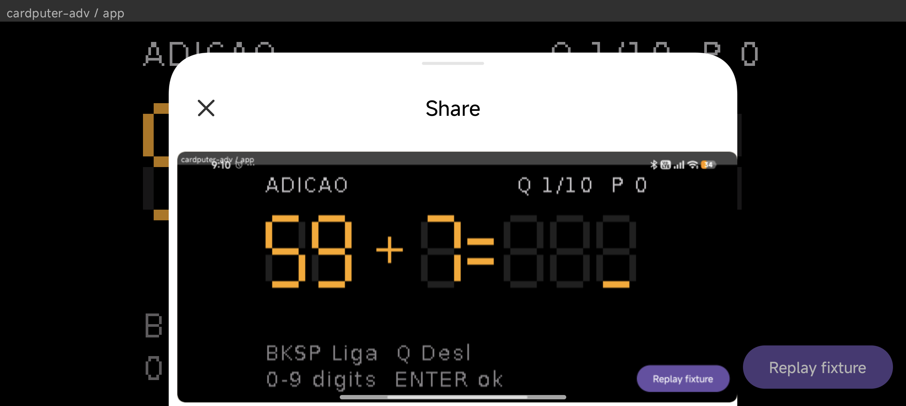
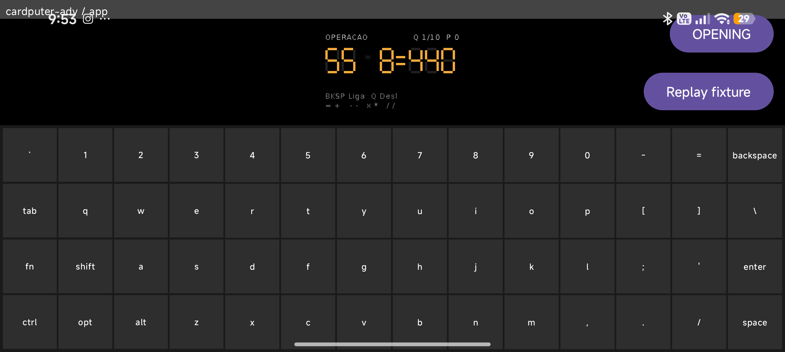
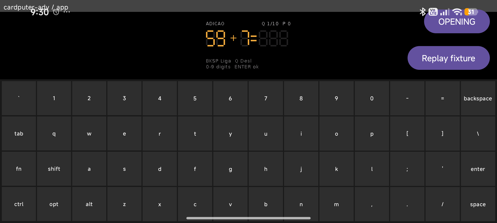
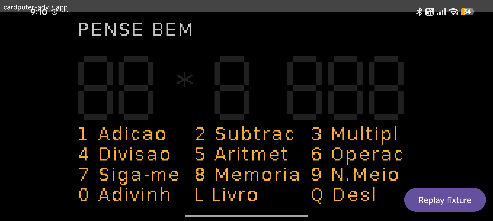

# DROIDPUTTER

Plug an ESP32-S3 into an Android phone over USB-OTG, open one app, and the
phone becomes the Cardputer: the ESP runs the app, the phone IS its screen,
keyboard, GPS and app launcher. The ESP needs no display or keyboard of its
own — a bare ESP32-S3 (the Cardputer's StampS3 class, 8 MB flash) is the
target; a real Cardputer ADV is used in dev only because its own TFT gives
ground truth next to the phone.

Proven on hardware (2026-09-02/03, see [progress.txt](./progress.txt) S1–S5
and the phone-pass entries): a patched M5GFX 0.2.27 / M5Cardputer 1.1.1
**shim** tees every pixel write over USB-CDC and merges KEY frames injected
from the phone. Any open-source Cardputer app, rebuilt against the shim
UNCHANGED, becomes a transparent phone mirror — no per-app protocol code.
Bruce firmware is **not** part of this project (never a dependency); see the
appendix in [SPEC.md](./SPEC.md) for why it's prior art only.

## Demo

Pense-Bem (an unmodified third-party Cardputer app) played entirely from the
phone — soft keyboard tap driving the ESP, screen mirrored live:

| | |
|---|---|
|  |  |
|  |  |

A 30 s screen recording exists at `docs/img/phone-demo.mp4` (git-ignored,
6.4 MB — regenerate with `adb shell screenrecord` per
[progress.txt](./progress.txt)'s end-to-end entry rather than pulling it from
git).

## How it works

- **Wire protocol** — [docs/PROTOCOL.md](./docs/PROTOCOL.md): framing,
  frame types (HELLO/FILL/RECT/RECT_RLE/STATS/PING, KEY/GPS_NMEA/HELLO_ACK),
  bandwidth budget, measured throughput.
- **Shim mechanism** — [shim/README.md](./shim/README.md): which functions
  are patched and why, the overlay recipe, the virtual no-display panel
  (`Panel_Droidputter`), version pins.
- **Fixtures** — [fixtures/README.md](./fixtures/README.md): captured real
  USB streams committed to the repo and replayed by both the Kotlin test
  suite and the app's offline demo mode.

## Build a shim overlay for your own app

Full recipe: [docs/PORTING.md](./docs/PORTING.md). Short version — three
ingredients on top of your app's unmodified source:

```ini
[platformio]
src_dir = /path/to/the/unmodified/app/src
lib_extra_dirs = ../../shim/lib

[env:m5cardputer]
lib_deps =
    m5stack/M5Unified@0.2.20
    symlink://../../shim/lib/DroidputterShim
build_flags =
    -DDROIDPUTTER=1
    -I ../../shim/lib/DroidputterShim/src
```

```sh
shim/apply.sh apps/<your-app> /path/to/m5cardputer/libdeps   # materialises patched lib/M5GFX + lib/M5Cardputer
cd apps/<your-app> && pio run -e m5cardputer
```

See `apps/pense-bem/` (a private app, unmodified) and `apps/m5-example/`
(the M5Cardputer library's own upstream example) for two working overlays.

## Flash from a phone

No native flasher yet — the Android app hands off the built `.bin` parts to
any third-party ESP32 flasher (e.g. Play Store `ESP32_Flasher`) via the
share sheet, or you flash manually with the offsets below. Full detail,
including the phone-side "Catalog" share flow: [docs/FLASHING.md](./docs/FLASHING.md).

| File             | Offset  |
|------------------|---------|
| `bootloader.bin` | `0x0`   |
| `partitions.bin` | `0x8000`|
| `boot_app0.bin`  | `0xE000`|
| `firmware.bin`   | `0x10000`|

Every droidputter-ready build is listed with its parts, offsets and sha256
in [apps/catalog.json](./apps/catalog.json) (regenerate with
`python3 tools/make_catalog.py`).

## Status per board

| Board | Real panel build | Virtual (no-display) build | Hardware verified | Notes |
|---|---|---|---|---|
| Cardputer / Cardputer ADV (ESP32-S3) | `m5cardputer` | `m5cardputer-virtual` | [REAL] — S1–S5, phone end-to-end | Flagship dev target |
| M5Stack StickS3 (ESP32-S3-PICO-1-N8R8) | `m5stack-sticks3` | `m5stack-sticks3-virtual` | build-only [UAT pending] | Toolchain-only proof this session; needs the physical unit for the hardware UAT |
| ESP32-C5 | — | — | blocked | `espressif32@6.12.0` (arduino-esp32 2.0.17) has no C5 board defs; needs arduino-esp32 3.x, a repo-wide platform re-pin, out of scope so far |
| Bare ESP32-S3-N16R8 devkit | `esp32-s3-devkitc-1-virtual` | same | build-only [UAT pending] | The north-star board: no display of its own, phone is the only screen; reserved for esp-claw, needs Felipe's explicit OK before hardware use |

## Repo layout

`shim/` (PlatformIO library: patched M5GFX + M5Cardputer + USB framing),
`tools/` (host-side Python receiver/renderer/catalog scripts), `fixtures/`
(captured real streams, committed), `apps/` (build recipes per app +
`catalog.json`), `android/` (Gradle project: `core` pure-JVM Kotlin +
`app` Android/Compose shell), `docs/`.

Ground rules and golden rules: [docs/GROUND_RULES.md](./docs/GROUND_RULES.md).
Roadmap: [SPEC.md](./SPEC.md).
