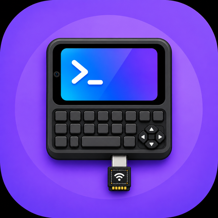
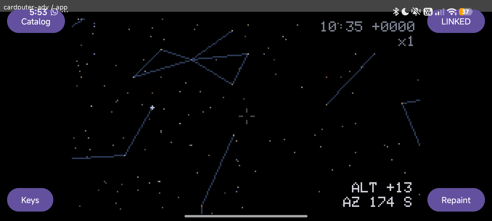
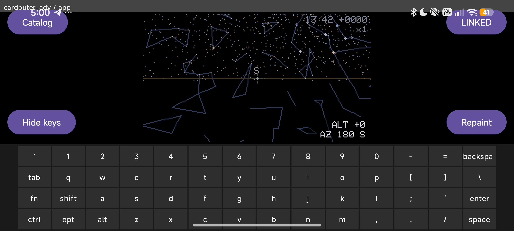
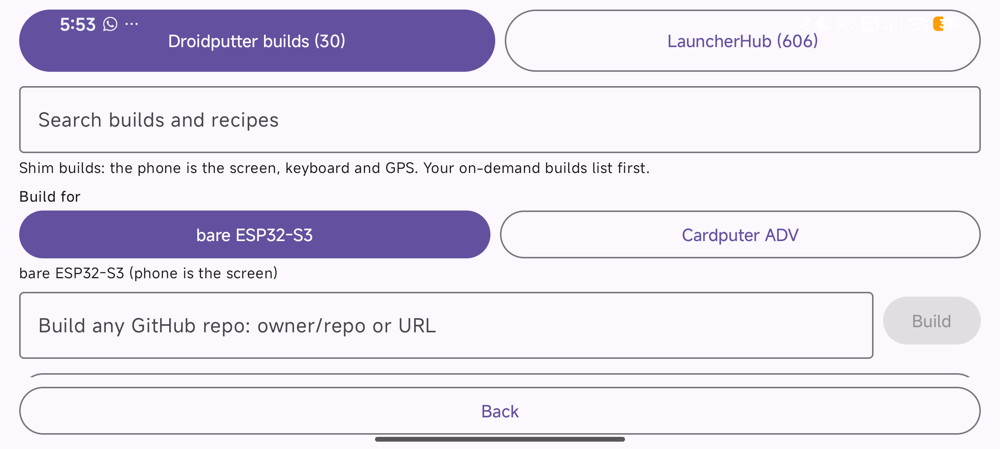
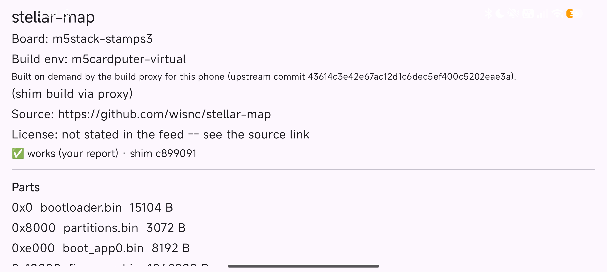
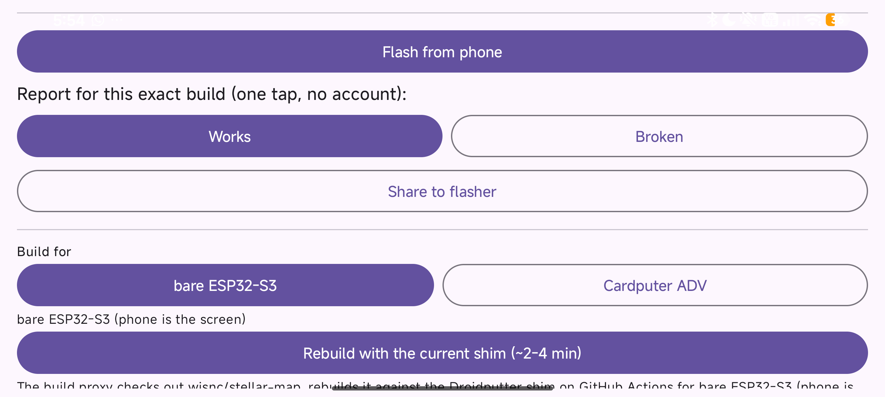
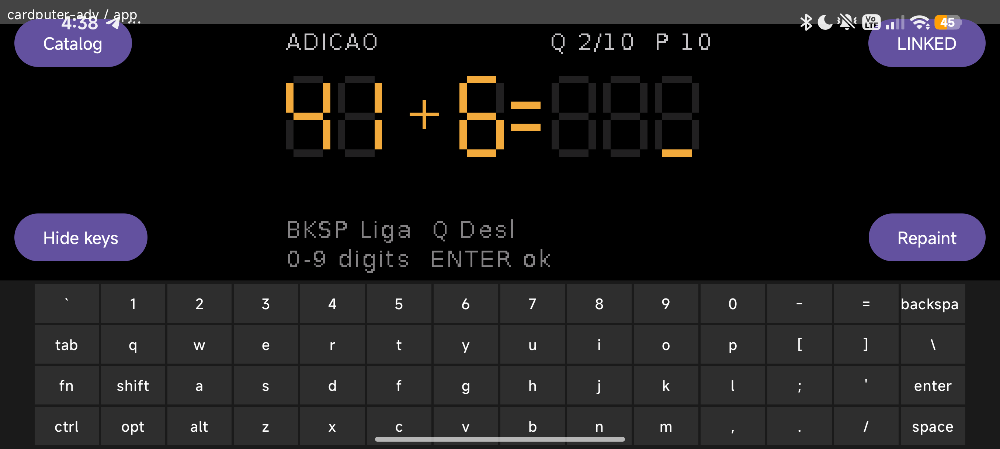

<div align="center">



<h1>Droidputter</h1>

<p><strong>Plug an ESP32-S3 into an Android phone. The phone becomes the Cardputer.</strong></p>

<p>Open-source Cardputer apps, rebuilt on demand from GitHub against a display and keyboard shim,
flashed from the phone, mirrored on the phone, driven from the phone's keyboard and GPS.<br>
The ESP32-S3 runs the app; the phone adds screen, keys, location and a flasher. No display needed on the board.</p>

<p>
<a href="#how-to-use">How to use</a> ·
<a href="#ways-to-flash">Ways to flash</a> ·
<a href="#under-the-hood">Under the hood</a> ·
<a href="#tested-boards-and-phones">Tested boards</a> ·
<a href="https://github.com/fcavalcantirj/droidputter/releases">Releases</a>
</p>

<p>
<a href="https://github.com/fcavalcantirj/droidputter/releases/latest"></a>
<a href="https://github.com/fcavalcantirj/droidputter/actions/workflows/android.yml"></a>
<a href="https://github.com/fcavalcantirj/droidputter/actions/workflows/release.yml"></a>


<a href="LICENSE"></a>
</p>

</div>

<p align="center">

</p>
<p align="center"><em>wisnc/stellar-map on a bare ESP32-S3-N16R8 devkit with no display: built from GitHub on demand, flashed from the phone, mirrored on the phone.</em></p>

## What it is

Any open-source Cardputer app, rebuilt **unchanged** against a patched M5GFX 0.2.27 / M5Cardputer 1.1.1
**shim**, becomes a phone app: the shim tees every pixel write over the ESP32-S3's native USB-CDC and
merges the phone's KEY and GPS frames into the app's keyboard and serial. Builds happen on GitHub
Actions through a small proxy, the phone flashes the result itself, and the same phone is then the
display, keyboard, GPS and app launcher. A real Cardputer ADV is only used in development because its
own TFT shows the same frames next to the phone.

<table>
<tr>
<td align="center"><br><sub>The soft keyboard is the Cardputer's own 4x14 matrix, fn and shift layers included.</sub></td>
<td align="center"><br><sub>Same app, panned from the phone. Nothing on the board but the chip.</sub></td>
</tr>
<tr>
<td align="center"><br><sub>Catalog: pick the target, a recipe, any GitHub repo, or a LauncherHub prebuilt.</sub></td>
<td align="center"><br><sub>A finished on-demand build: parts, offsets, hashes, verdicts.</sub></td>
</tr>
<tr>
<td align="center"><br><sub>Flash from phone, then one tap files the works / broken verdict.</sub></td>
<td align="center"><br><sub>A StickS3 with its own screen dark playing a Cardputer game from the phone.</sub></td>
</tr>
</table>

## How to use

1. Install the release APK from https://github.com/fcavalcantirj/droidputter/releases
   (`adb install droidputter-<tag>.apk`, e.g. `droidputter-v0.0.1.apk`, or open the file on the
   phone). Android 8+ with USB-OTG host support.
2. Plug an ESP32-S3 into the phone's USB-C port with an OTG cable, into the board's native USB port.
   Use a known-good data cable: one cable gave "no Type-C partner" (2026-09-02).
3. Answer "Allow Droidputter to access USB JTAG/serial debug unit?" once. The top-right button shows
   the link state (DETACHED, LINKED, ...) and opens the Connection screen.
4. Tap **Catalog** (top left). Two sources: **Droidputter builds** (your own proxy builds first,
   then the `apps/` recipes) and **LauncherHub** (prebuilt M5Burner bins, flash only).
5. Under **Build for**, pick the target: **bare ESP32-S3** (the phone is the only screen; the
   default) or **Cardputer ADV** (the board's own TFT is teed to the phone).
6. Pick an app: a recipe entry, any GitHub repo pasted as `owner/repo` or a URL into "Build any
   GitHub repo", or a LauncherHub prebuilt (no build step: skip to 8).
7. Tap **Build mirror version (~2-4 min)** (**Rebuild with the current shim** on one of your own
   builds). The status line goes "asking the build proxy…" then "queued (0:05 elapsed)" then
   "building… (run <id>, 1:23 elapsed)" then "Ready: flash it from the Droidputter builds tab".
   Measured 2 min 4 s warm, 4 min 8 s cold (2026-09-04). A build the proxy already has (same repo,
   ref, target and shim, under 24 h) answers "the proxy already has this build, fetching its parts"
   at once (3 s on 2026-09-16).
8. Tap **Flash from phone**. You see "downloading firmware.bin 1.0 MB (43%)", "stopping the link,
   opening the port", "resetting into the ROM bootloader", one erase line and one write line per
   part with a percentage, "<part>: verified (md5 ...)", "all parts verified, rebooting the ESP",
   then "done: <name> flashed and verified". Reset-to-verified: 8 s for 467 KB and 15 s for
   1.07 MB (2026-09-16), 14.7 s for 1.1 MB compressed (2026-09-03); the link is back 190-330 ms
   after the reset (2026-09-16).
9. Use it: the ESP's screen is the phone's screen. The soft keyboard is the Cardputer's 4x14 matrix;
   **fn** and **shift** latch on a tap (the key caps switch to the fn or shifted legends) until
   tapped again; **Hide keys / Keys** gives the mirror the whole screen.
10. A Bluetooth or USB keyboard attached to the phone works too: every key with a Cardputer position
    is passed through (key repeats swallowed); the rest reach Android as usual.
11. GPS: open the Connection screen and tap **Start GPS feed**; grant location once. The phone's
    NMEA sentences reach the app like a serial GPS (`droidputter_gps()`, ~28 sentences/s on
    2026-09-05); the link's foreground service keeps them flowing with the screen off.
12. **Repaint** (bottom right) re-sends HELLO_ACK and the ESP redraws its whole screen into the
    phone; **Reconnect** on the Connection screen re-probes the port and asks for permission again.
13. Verdict: 20 s after the flash the app decides works / broken from the link evidence (boot
    report, HELLO, frames) or asks "Works or Broken?". One tap on **Works** / **Broken** files a
    GitHub issue through the proxy ("verdict sent (#N) — thank you"); an Action folds it into
    `apps/verdicts.json`, which every phone reads back.

```
┌─────────┐  POST /api/build   ┌───────────────┐  workflow_dispatch  ┌────────────────┐
│  phone  │ ─────────────────▶ │  build proxy  │ ──────────────────▶ │ GitHub Actions │
│ Catalog │ ◀───────────────── │   (Vercel)    │ ◀────────────────── │ build-app.yml  │
└────┬────┘  parts + sha256    └───────────────┘  run artifact (zip) └────────────────┘
     │ USB-OTG: reset into the ROM, 4 parts written + MD5-verified, hard reset
     ▼
┌──────────┐
│ ESP32-S3 │  relinks 190-330 ms after the reset: HELLO, then frames = the phone is the screen
└──────────┘
```

### First flash gotchas

- **BOOT button for software-CDC firmwares.** A board still running UiFlow2 / MicroPython (a TinyUSB
  software CDC) ignores the phone's DTR/RTS reset; the status line says "no ROM bootloader yet -- if
  the board stays quiet, hold its BOOT button and replug it now (waiting 90 s)". Hold BOOT while
  plugging it back in: the ROM enumerates as "USB JTAG/serial debug unit" and the flash continues.
  Once a Droidputter build is on the board, the phone resets it alone (2026-09-05, StickS3).
- **The UART/COM port of a devkit never works.** The shim only speaks over the S3's native
  USB-Serial/JTAG; a CH9102 or CH343 bridge shows up as "USB Single Serial" and never carries the
  link (2026-09-05, 2026-09-16), and any other UART bridge (CP210x, ...) is no different. Use the
  port labeled USB.
- **Wrong chip = refused, nothing written.** The flasher reads the chip magic before touching the
  flash (ESP32-S3 = 0x9); an ESP32-C5 stopped at "FAILED: not an ESP32-S3 ROM (chip magic
  0x30e1706f)" with its firmware intact (2026-09-16). A classic ESP32 cannot run the S3 build
  either.
- **Debug APK vs release APK.** They are signed with different keys: a debug build (`android.yml`
  or a local `assembleDebug`) cannot be installed over the release APK, nor the reverse. Uninstall
  first (2026-09-16).

## Ways to flash

| # | Path | Mirror | Pick it when |
|---|------|--------|--------------|
| a | In-app: build on demand via the proxy | yes | the app is on GitHub (M5GFX/M5Unified) |
| b | In-app: LauncherHub / M5Burner prebuilt | no | a stock bin on the board's own screen |
| c | In-app: Share to flasher | as the parts | the parts must leave the phone (share sheet) |
| d | Computer: esptool + a build-app.yml artifact | yes | batch flashing, or no phone at hand |
| e | Computer: PlatformIO from a recipe dir | yes | you are developing the shim or an overlay |
| f | Manual BOOT bootstrap (with any path) | n/a | the board's firmware ignores the USB reset |

```
(a) in-app proxy build    ─┐
(b) LauncherHub prebuilt  ─┴─▶ Flash from phone (in-app esptool) ──┐
(c) Share to flasher      ───▶ another flasher app (phone) ────────┼──▶ ┌──────────────────┐
(d) esptool, run artifact ─┐                                       │    │ ESP32-S3 on its  │
(e) pio run -t upload     ─┴─▶ computer, esptool / pio ────────────┘    │ native USB port  │
                                                                        └──────────────────┘
(f) hold BOOT while plugging in, once, before any path when the old firmware is a software CDC
```

**(a) In-app, on-demand shim build via the proxy.** You need the phone, network and an ESP32-S3 on
OTG. Tap "Build mirror version" on any entry with a GitHub source, or paste `owner/repo` into "Build
any GitHub repo" after picking the target. The phone POSTs to the build proxy (`proxy/`, five
Vercel functions holding a repo-scoped token), which dispatches `.github/workflows/build-app.yml`:
`tools/overlay.py` clones the app, writes the overlay, `shim/apply.sh` patches M5GFX 0.2.27 and
M5Cardputer 1.1.1, PlatformIO builds it, and the proxy streams the four parts (sha256 from the run's
`SHA256SUMS`) out of the `<name>-<env>` artifact. Mirror: yes. Limits: 6 builds in flight, a
successful run under 24 h for the same repo@ref, env and shim is reused, artifacts live 7 days.
Proven end to end from GitHub source to a StickS3 with its own screen dark (2026-09-16, the current
virtual env) and to a bare ESP32-S3-N16R8 devkit (2026-09-16, with the proxy's 2026-09-05 build).

**(b) In-app, LauncherHub / M5Burner prebuilt.** You need the phone and network once: the ~3 MB feed
from `api.launcherhub.net` is cached and refreshed at most daily (606 entries on 2026-09-16). Every
Cardputer/StampS3 entry on the S3 chip with an install format is listed: `merged` images flash at
0x0, `app` images at 0x10000 (that keeps the board's bootloader and partition table; any Droidputter
or Arduino 8 MB build leaves a compatible one). Flash-only: the bin carries no shim, so no phone
mirror, keyboard or GPS; the app runs on the Cardputer's own screen and keys. The hash is computed
after download; the verdict is yours ("Works or Broken?"): the phone only flags a crash loop (a
panic or 3+ resets in 20 s) on the status line. Any such entry with a GitHub source can be rebuilt
with the shim from its detail ("Build mirror version"). Same download + flasher code as (a), but
[UNVERIFIED] on hardware: the journal records no LauncherHub bin flashed from the phone yet (the
Ultimate Remote flash "still awaits Felipe's taps", 2026-09-04).

**(c) In-app "Share to flasher".** The app downloads the parts and hands them to the Android share
sheet as `content://` streams plus a text blob listing offset, size and sha256 per part. Mirror:
whatever the parts are (a shim build yes, a LauncherHub bin no). ESP32_Flasher
(`com.esp_flash.esp_flash_app`) does NOT appear in that sheet: it registers no SEND/SEND_MULTIPLE
intent (2026-09-03), so share the parts to an app that saves files, then pick them in ESP32_Flasher
(chip ESP32S3, Bootloader Auto ON, each file at its offset). That flasher's own auto-reset entered
the ROM on a freshly plugged Cardputer ADV (2026-09-02: 504,176 B firmware in 19.39 s) but not on a
board that had been running a shim app for an hour (2026-09-03). Pick it when the files must leave
the phone.

**(d) From a computer with esptool, from a build-app.yml run artifact.** You need `gh` with access
to the repo, esptool, and a cable to the board's native USB port.

```
gh workflow run build-app.yml -f repo=wisnc/stellar-map -f name=stellar-map \
    -f env=m5cardputer-virtual
gh run list --workflow build-app.yml                       # the run id
gh run download <run-id> -n stellar-map-m5cardputer-virtual -D dist
cd dist && sha256sum -c SHA256SUMS
esptool.py --chip esp32s3 write_flash 0x0 bootloader.bin 0x8000 partitions.bin \
    0xE000 boot_app0.bin 0x10000 firmware.bin
```

| File             | Offset    |
|------------------|-----------|
| `bootloader.bin` | `0x0`     |
| `partitions.bin` | `0x8000`  |
| `boot_app0.bin`  | `0xE000`  |
| `firmware.bin`   | `0x10000` |

The artifact holds the four parts, `build.json` and `SHA256SUMS`; retention is 7 days (the
`<name>-<env>-elf` artifact beside it is the ELF for addr2line, not for flashing). `env` is
`m5cardputer` (Cardputer ADV, the default) or `m5cardputer-virtual` (bare ESP32-S3). Mirror: yes.
Pick it when there is no phone at hand, for batch flashing, or when the board needs the ROM entered
by hand anyway.

**(e) From a computer with PlatformIO, from a recipe dir.** You need PlatformIO Core (CI pins
6.1.19), the app's source (recipes written by `tools/overlay.py` point at `apps/_src/<name>`, which
is git-ignored, so clone first) and the board on `/dev/cu.usbmodem*`. One command clones, writes the
overlay, runs `shim/apply.sh`, builds and uploads:

```
python3 tools/overlay.py wisnc/stellar-map --name stellar-map \
    --env m5cardputer-virtual --build --upload
```

Or, inside an existing recipe, after `shim/apply.sh apps/<name>` once (without it the build either
fails on a fresh clone, `M5Cardputer.h: No such file`, 2026-09-03, or silently produces a firmware
whose tee never fires, 2026-09-02):

```
cd apps/<name> && pio run -e m5cardputer -t upload           # Cardputer ADV, its TFT teed
cd apps/<name> && pio run -e m5cardputer-virtual -t upload   # bare ESP32-S3, phone only
```

Upload runs at 460800 baud. Mirror: yes. Pick it when working on the shim or an overlay, or when a
build must never leave your machine (pense-bem's source is a local path, so it has no proxy build).
The committed overlay.py recipes carry both envs, but their `m5cardputer-virtual` env is the older
one (StampS3 variant, M5GFX board hint 24) that a StickS3 refused (2026-09-05/16); regenerate the
recipe with `tools/overlay.py` to get the current virtual env (`esp32-s3-devkitc-1`, hint 26,
`qio_opi` + PSRAM), which the proxy always does on the runner.

**(f) The manual BOOT bootstrap.** Not a path of its own but the entry step any of the above may
need: a board whose current firmware drives USB as a software CDC (UiFlow2, MicroPython, TinyUSB)
never forwards DTR/RTS to the reset logic, so neither the phone flasher nor esptool can enter the
ROM. Hold BOOT while plugging the board in; the ROM enumerates as "USB JTAG/serial debug unit". The
phone waits 90 s for exactly that re-enumeration and then continues the flash; otherwise it ends
with "FAILED: ROM bootloader did not come back on USB (hold BOOT while plugging the board in, then
Flash again)". Once a Droidputter build (arduino HWCDC) is on the board, every later flash resets it
from the phone alone (2026-09-05, StickS3; 2026-09-16, StickS3 and the bare devkit, whose previous
firmware was also an arduino HWCDC build). Mirror: n/a.

## Under the hood

Four mechanisms, each read off the code it names. Every number below comes from the source file in
parentheses or from `progress.txt` on the date given.

### The link

```
┌─────────────────────────────┐                                  ┌─────────────────────────────┐
│ Android phone (OTG host)    │  ESP32-S3 ──▶ phone              │ ESP32-S3 (USB-Serial/JTAG)  │
│                             │  HELLO 0x01 w,h,rot,bpp,board,app│ DroidputterShim             │
│ UsbDpTransport              │  FILL 0x02 x,y,w,h,color 10 B    │  dp_link task every 16 ms   │
│  CDC-ACM 0x303A:0x1001      │  RECT 0x03 raw RGB565 rows       │   (DP_LINK_TASK_MS): poll,  │
│  16 KB USB reads            │  RECT_RLE 0x04 runs n u8,c u16   │   STATS, watchdog, flush    │
│  Framer: D7 50 type len16   │  STATS 0x05 1/s   LOG 0x07       │  HWCDC TX ring 32,768 B     │
│   payload crc8 (poly 0x07)  │  PING 0x06 answers PING_IN       │   (DROIDPUTTER_TXBUF)       │
│  decodeDpMessage            │◀──────────────────────────────── │  shadow fb 240x135, 64,800 B│
│  ScreenCanvas paints        │ ────────────────────────────────▶│  dirty row band -> RECT_RLE │
│                             │  phone ──▶ ESP32-S3              │   (or RECT), whole rows that│
│ SoftKeyboard                │  HELLO_ACK 0x84 phone w,h        │   fit the ring's free space │
│ GpsFeed (OnNmeaMessage)     │  KEY 0x81 row,col,down|up        │  rx[128]: inbound <= 120 B  │
│ LinkStateMachine            │  GPS_NMEA 0x82 one sentence      │  16 key slots, 1 KB GPS ring│
│  PING_IN probe 1/s to link  │  PING_IN 0x83 probe/keepalive    │  LOG: boot / watchdog report│
└─────────────────────────────┘                                  └─────────────────────────────┘
```

One byte stream in each direction over the ESP32-S3's native USB-Serial/JTAG (`HWCDC Serial`;
the phone enumerates it as CDC-ACM `0x303A:0x1001`, `UsbLinkManager.kt`). Every frame is
`D7 50 | type u8 | length u16 LE | payload | crc8` (poly 0x07 over type+length+payload,
`docs/PROTOCOL.md`, `core/protocol/Framer.kt`); a bad crc drops only the sync pair and rescans.
ESP to phone: HELLO (55 B: geometry, bpp 16, board, app -- the board string is always
`cardputer-adv` today, `sendHello` in `droidputter.cpp`), FILL, RECT (raw big-endian RGB565
rows), RECT_RLE (runs of `count u8, color u16`), STATS once a second, PING, LOG
(`"boot rst=.. wd=.."` and watchdog reports). Phone to ESP: HELLO_ACK (the phone's w,h -- the
tee sends nothing before it), KEY (row, col, down/up on the 4x14 matrix), GPS_NMEA (one sentence,
no CRLF), PING_IN.

The phone reads the port in 16 KB requests (`USB_READ_BUFFER`, `android/app/build.gradle.kts`):
with the library's 64 B default the reader took 1,670 chunks/s, the framer resynced 116 times in
70 s and the app sat at 93% CPU; at 16 KB it is 54 chunks/s, 0 resyncs, 62% CPU, key echo
19.5 ms median (2026-09-05). On the ESP the shim runs its own FreeRTOS task, `dp_link`, every
16 ms (`DP_LINK_TASK_MS`, `droidputter.cpp`): it parses inbound frames, emits STATS, drives the
TX watchdog and flushes the shadow, so an app that never calls `M5Cardputer.update()` still links.
Outbound frames go whole-or-nothing into the 32,768 B HWCDC TX ring (`DROIDPUTTER_TXBUF`); a
full 240x135 frame is 64,800 B raw, so a flush sends as many whole dirty rows as the ring has room
for (capped by a 32 KB RLE stage), RLE when that is shorter than raw, and leaves the rest dirty
for the next tick (`dp_display.cpp`, band splitting since 2026-09-04). Inbound frames are capped
at 120 B of payload (`rx[128]`); held keys live in 16 slots, NMEA in a 1 KB ring.

Measured: the raw ceiling is 13.8 fps / 873 KB/s of uncompressed full frames (2026-09-02; the
TX-ring sweep gave 11.0 fps at 8 KB, 14.7 fps at 64 KB, so the ceiling is USB full speed, not the
ring). wisnc/stellar-map mirrored on the Poco X7 Pro at 14 fps / 131.6 KB/s median with 15
governor deferrals/s before band splitting (2026-09-04), then 29.6 fps / 101.3 KB/s with 0 dropped
frames -- the app's own draw rate, not the link, is the limit -- and 59.6 fps / 166.8 KB/s median
in a busier draw state of the same app, on the 64 B-read build (2026-09-05). After a hard reset
the phone's HELLO_ACK lands 300 ms later (2026-09-03, 2026-09-05) and 190-330 ms across the four
2026-09-16 flashes; a fresh plug links in 230 ms (2026-09-04). A `LinkForegroundService` keeps the
reader and the GPS feed (about 28 sentences/s, 2026-09-05) alive with the screen off. The link
drops on a USB detach or a reader `IOException` and comes back on the next attach intent
(`UsbLinkManager.kt`); `LinkStateMachine`'s three-missed-PING rule (`MAX_MISSED_PINGS`) has no
timer feeding it yet, so PING_IN is a probe: once when the port opens, then every second for 30 s
until the ESP's HELLO arrives (`PROBE_INTERVAL_MS`, `PROBE_ATTEMPTS`, `MainActivity.kt`).

### The shim

```
                 app code: M5.Display.fillRect / drawString / pushSprite ... (unchanged)
                                                 │
                                                 ▼
                      LovyanGFX write path (LGFXBase -> Panel), then one of two panels
                        ┌────────────────────────┴─────────────────────────┐
                        ▼                                                  ▼
┌──────────────────────────────────────┐                ┌────────────────────────────────────────┐
│env m5cardputer (Cardputer ADV)       │                │env m5cardputer-virtual (bare ESP32-S3) │
│Panel_LCD (ST7789) with 8 dp:: hooks  │                │Panel_Droidputter (dp_panel.h) picked by│
│(M5GFX-0.2.27-droidputter.patch):     │                │the patched M5GFX::init_impl when built │
│  setWindow  writePixels  writeBlock  │                │with -DDROIDPUTTER_VIRTUAL=1: autodetect│
│  writeImage  writeFillRectPreclipped │                │skipped, no bus, no SPI, no TFT. Same   │
│  drawPixelPreclipped  write_bytes    │                │six overrides on Panel_FrameBufferBase  │
│        │              │              │                │(+ writeImageARGB, copyRect -> teeRect) │
│        ▼              ▼              │                │                  │                     │
│  SPI bus -> TFT   dp:: tee           │                │                  ▼                     │
│                       │              │                │             dp:: tee only              │
└───────────────────────┬──────────────┘                └──────────────────┬─────────────────────┘
                        └────────────────────────┬─────────────────────────┘
                                                 ▼
         dp::window / bytes / repeat / fill / pixel / pixelsConv  (dp_display.cpp), lazy dp::begin
                                                 │
                                                 ▼
         shadow framebuffer 240x135 RGB565 in wire order + dirty row band  (dp_shadow.h, static)
                                                 │  flushDirty each 16 ms, only after HELLO_ACK
                                                 ▼
         RECT_RLE (or RECT) of as many whole rows as the HWCDC ring can take -> USB -> phone

  keys: phone KEY 0x81 -> dp_keys_push (16 held slots) -> Keyboard_Class::updateKeyList (patched,
        M5Cardputer-1.1.1-droidputter.patch) merges the held (row,col) set into
        KeyboardReader::mutableKeyList -> M5Cardputer.Keyboard.keysState() as if pressed
  GPS:  phone GPS_NMEA 0x82 -> dp_gps_push -> 1 KB ring (whole sentences + CRLF) ->
        droidputter_gps(), an Arduino Stream the app reads exactly like its GPS UART
```

The app is compiled unchanged; only the libraries under it change. `shim/patches/M5GFX-0.2.27-
droidputter.patch` adds eight `dp::` calls to `lgfx/v1/panel/Panel_LCD.cpp` -- `setWindow`,
`drawPixelPreclipped`, `writeFillRectPreclipped`, `writeBlock`, `writePixels` (both the raw and
the converting branch), `writeImage` (inside its DMA-queue loop) and `write_bytes` -- so every
pixel that reaches the ST7789 bus is also copied into the shim. On the Cardputer ADV the TFT keeps
drawing and the phone mirrors it (env `m5cardputer`: `m5stack-stamps3`, `espressif32@6.12.0`,
8 MB, `tools/overlay.py` ENV_TEMPLATE). On a bare ESP32-S3 (env `m5cardputer-virtual`:
`esp32-s3-devkitc-1`, octal PSRAM, `-DDROIDPUTTER_VIRTUAL=1 -DM5GFX_BOARD=26`) the same patch's
hook near the top of `M5GFX::init_impl` (right after the already-initialised check, before the
NVS/autodetect) constructs `Panel_Droidputter` (`dp_panel.h`), a `Panel_FrameBufferBase` over a
static 240x135 buffer with no bus at all, and returns before the I2C/SPI autodetect ever runs; its
overrides of the same six write functions plus `writeImageARGB` and `copyRect` feed only the shim
(`writeImage`, `writeImageARGB` and `copyRect` tee the rect after the base class has placed it,
`teeRect`), and its `setRotation` is pinned so the app's `setRotation(1)` never resizes the static
buffer. Either way the tee lands in the shadow framebuffer from the very first write, linked or
not; `dp::begin()` runs lazily from the first `setWindow`, opens `Serial`, sizes the ring, sends
HELLO, starts the link task and sends the boot LOG. HELLO_ACK (and the phone's Repaint button)
answers from memory: mark every row dirty and flush. A full Pense-Bem screen is one RECT_RLE of
9,956 B instead of 64,800 B raw (`docs/PROTOCOL.md`, 2026-09-02).

Keys never touch the app either: `M5Cardputer-1.1.1-droidputter.patch` makes
`Keyboard_Class::updateKeyList` call `dp::poll()` and then merge the shim's held (row,col) set
into `KeyboardReader::mutableKeyList` -- the same vector the physical TCA8418 scan fills -- adding
keys the phone holds and removing the ones it released (a tap stays visible for at least two
updates, `DP_KEYS_MIN_SEEN`). GPS is the one place an app opts in: the phone's
`OnNmeaMessageListener` sentences arrive as GPS_NMEA frames, `dp_gps_push` queues whole sentences
plus CRLF in a 1 KB ring, and the app reads `droidputter_gps()` -- an Arduino `Stream` -- exactly
where it would read its GPS UART (`apps/gps-demo`).

### Build on demand

```
 phone                        proxy (Vercel, Node 22)             GitHub fcavalcantirj/droidputter
┌─────────────────────┐       ┌───────────────────────────┐       ┌────────────────────────────────┐
│ Catalog: "Build     │       │ POST /api/build           │       │ workflow_dispatch build-app.yml│
│  mirror version" or │──────▶│  {repo, ref, name, env}   │──────▶│  run-name: build <repo>@<ref>  │
│  "Build any GitHub  │       │  identity = repo@ref + env│       │   env=<env> shim=<sha> req=<id>│
│  repo", target =    │       │   + shim commit (newest   │       │  tools/overlay.py --build:     │
│  bare ESP32-S3 |    │       │   of shim/, tools/        │       │   clone, write platformio.ini  │
│  Cardputer ADV      │       │   overlay.py; 60 s cache) │       │   shim/apply.sh patches M5GFX  │
│                     │       │  200 cached (success<24 h)│       │    + M5Cardputer, pio run -e   │
│ BuildFlow polls     │──────▶│  202 joined (in flight)   │       │  artifact <name>-<env>:        │
│  GET every 5 s      │       │  202 dispatched (uuid)    │       │   4 .bin + build.json          │
│                     │       │  429 at 6 in flight       │       │   + SHA256SUMS, kept 7 d       │
│ ready -> my_builds  │◀──────│ GET /api/build/{id}       │◀──────│  artifact <name>-<env>-elf     │
│  entry: parts by    │       │  run found by req=<id>,   │       │   (the ELF, never served)      │
│  url + sha256       │       │  zip unzipped in memory   │       │                                │
│                     │       │  (fflate), 8 runs cached  │       │                                │
│ BinStore: download, │◀──────│ GET /api/artifact/        │       │                                │
│  sha256 check,      │       │  {run}/{file} -> bytes,   │       │                                │
│  filesDir/bins      │       │  ETag = sha256, immutable │       │                                │
│ PhoneFlasher        │       │                           │       │                                │
└─────────────────────┘       └───────────────────────────┘       └────────────────────────────────┘
```

```
 verdict loop
┌─────────────────────┐       ┌───────────────────────────┐       ┌────────────────────────────────┐
│ 20 s after a flash: │──────▶│ POST /api/verdict         │──────▶│ issue "[verdict] <name>/<env>  │
│  auto works | broken│       │  validate, 20/h per IP,   │       │  <result> on <board> (<sha12>)"│
│  (or one tap)       │       │  4 KB max, files the      │       │  label verdict -> verdicts.yml │
│                     │       │  GitHub issue itself      │       │  -> tools/fold_verdict.py ->   │
│ VerdictRepository   │       │                           │       │  apps/verdicts.json on main,   │
│  reads verdicts.json│       │                           │       │  issue commented + closed      │
└─────────────────────┘       └───────────────────────────┘       └─┬──────────────────────────────┘
                      ◀─────────────────────────────────────────────┘
                        every phone reads raw.githubusercontent.com/.../main/apps/verdicts.json
```

Nothing is pre-built or hosted. The phone POSTs `{repo, ref?, name?, env?}` to `/api/build`
(`proxy/api/build.js`, validated by `proxy/lib/validate.js`; the name defaults to the repo's tail
lowercased). The proxy is five Vercel functions holding one fine-grained token scoped to
`fcavalcantirj/droidputter` (Actions read/write, Contents read, Issues read/write; `proxy/api/
shim.js`). A build's identity is `repo@ref` + `env` + the shim commit, the short sha of the newest
commit on `main` touching `shim/` or `tools/overlay.py` (`SHIM_PATHS`, `proxy/lib/github.js`,
cached 60 s), so editing the overlay template invalidates every cached build. A successful run
younger than 24 h with that identity answers `200 cached`; an identical run still queued or
running is joined (`202` with its request id); at 6 builds in flight the proxy answers `429` with
`Retry-After: 60`; otherwise it dispatches `build-app.yml` with a uuid that becomes part of the
run name, which is how the run is found again (`proxy/lib/builds.js`).

The workflow clones the upstream repo at `ref`, `tools/overlay.py --build` writes the overlay's
`platformio.ini` (both envs, from ENV_TEMPLATE), `shim/apply.sh` copies pristine M5GFX 0.2.27 +
M5Cardputer 1.1.1 into `lib/` and applies the two patches, and `pio run -e <env>` builds on a
GitHub runner with `~/.platformio` cached (`.github/workflows/build-app.yml`). The parts --
`bootloader.bin` 0x0, `partitions.bin` 0x8000, `boot_app0.bin` 0xE000, `firmware.bin` 0x10000,
plus `build.json` and `SHA256SUMS` -- are uploaded as the artifact `<name>-<env>`, kept 7 days
(`retention-days`); the 20-40 MB ELF rides in `<name>-<env>-elf`, which the proxy never serves.
`GET /api/build/{id}` polls the run by its `req=` tag, and once it is ready downloads the zip,
unzips it in memory (`fflate`, 8 runs cached per warm instance) and returns each part's offset,
size, sha256 and a `GET /api/artifact/{run}/{file}` URL served immutable with the sha256 as
ETag (`proxy/lib/artifact.js`, `proxy/api/artifact/[run]/[file].js`). The phone polls every 5 s
(`BuildProxy.POLL_INTERVAL_MS`, up to 20 min), saves a ready build as a catalog entry in
`my_builds.json`, and `BinStore` downloads each part into `filesDir/bins/<sha256>.bin`, verifying
the hash; a cached part is served with no network. Measured on 2026-09-04: 88.7 s from dispatch
to a successful run (about 92 s tap-to-hash-verified parts) for a repo nobody had built before
(geo-tp/M5Cardputer-GPS-Logger), 2 min 4 s warm vs 4 min 8 s cold for stellar-map, 169.3 s to
verified parts for Ultimate-Remote's 3,276,784 B firmware; a cached answer came back in 3 s
(2026-09-16).

The verdict loop closes the same way. 20 s after a flash the phone decides works / broken from the
link (see below) or asks for one tap, then POSTs the record to `/api/verdict` (`proxy/api/
verdict.js`: 20 per address per hour, 4 KB max). The proxy files the GitHub issue itself
(`[verdict] <name>/<env> <result> on <board> (<sha12>)`, label `verdict`); `verdicts.yml` runs on
every such issue, `tools/fold_verdict.py` validates and de-duplicates it into `apps/verdicts.json`,
the workflow commits to `main` and comments and closes the issue. `VerdictRepository` reads that
file back from `raw.githubusercontent.com` on every Catalog open and resends any verdict that
was stored on the phone while offline.

### Flash from phone

```
   phone: PhoneFlasher + core/esptool (Kotlin)              ESP32-S3 over USB-OTG
   ───────────────────────────────────────────────────      ─────────────────────────────────
 1 link stands down: UsbLinkManager.beginRawSession,        app firmware running
   port reopened raw (parts already in BinStore)
 2 DTR/RTS dance (esptool UsbJtagSerialReset):         ──▶  EN low while IO0 low -> ROM
   DTR=1,RTS=0 / RTS=1,DTR=0 / both 0; wait 300 ms          bootloader; the USB-Serial/JTAG
                                                            enumeration survives (same port)
 3 SLIP 0xC0..0xC0: SYNC 0x08, 5 tries, same port      ──▶
   (else wait 90 s for a re-enumeration: BOOT button)  ◀──  SYNC echoes (drained for 200 ms)
 4 READ_REG 0x40001000 must be 0x9 (ESP32-S3)          ◀─▶  chip magic; C5 0x30e1706f refused
 5 SPI_ATTACH, SPI_SET_PARAMS (8 MB flash)             ──▶
 6 per part: FLASH_DEFL_BEGIN (zlib level 9) +         ──▶  erase region, inflate, write
   FLASH_DEFL_DATA in 1 KB blocks (raw fallback)            (esptool's ROM encodings)
     bootloader.bin 0x0      partitions.bin 0x8000
     boot_app0.bin  0xE000   firmware.bin   0x10000
 7 then per part: SPI_FLASH_MD5 == MD5 of the bytes    ◀─▶  md5 of the flashed region
   sent (no FLASH_END: it would run the app early)
 8 hard reset: DTR=0, RTS=1, 100 ms, RTS=0             ──▶  new app boots
 9 endRawSession -> relink: PING_IN, ACK the HELLO     ◀──  LOG "boot rst=..", HELLO, frames
   SEND_HELLO_ACK 190-330 ms after the reset
10 20 s window: boots / hello / frames ->              ◀──  LOG boot reports, HELLO, RECTs
   auto-verdict works | broken | ask
```

`PhoneFlasher.kt` plus the pure-Kotlin `core/esptool` package (`Slip.kt`, `RomProtocol.kt`,
`EspFlasher.kt`) is esptool's `write_flash --no-stub` for the ESP32-S3 ROM, byte-exact with
esptool's encodings (4 status bytes per response, the extra word in FLASH_BEGIN and SPI_ATTACH,
1 KB write blocks). The parts are downloaded first, so a missing network never takes the link down.
Then `UsbLinkManager.beginRawSession` parks the state machine and hands the port over; the DTR/RTS
sequence of `UsbRomLink.resetIntoBootloader` maps onto GPIO0/EN the way a serial adapter's would,
and because the USB-Serial/JTAG peripheral keeps its enumeration across the chip reset the ROM
answers SYNC on the same port (2026-09-03). The chip magic at `0x40001000` must read `0x9`: an
ESP32-C5 (`0x30e1706f`) is refused before anything is written (2026-09-16). Each part goes through
FLASH_DEFL_BEGIN/FLASH_DEFL_DATA as a zlib level-9 stream the ROM inflates, with a raw fallback if
the ROM refuses, and no FLASH_END (on the ROM loader it would boot the chip early); once every
part is written, every region is read back as MD5 and compared. A 1,113,008 B firmware went over
the wire as 658,816 B in 11.3 s (12.9 s raw), reset-to-verified 14.7 s (2026-09-03); the board
table above lists 13 s for 1.1 MB on the ADV, 8 s for 470 KB on the StickS3 (467,456 B,
2026-09-16) and 15 s for 1.07 MB on the bare devkit (2026-09-16).

`hardReset` pulses EN with GPIO0 released, `endRawSession` re-probes the device, and the normal
link comes back on its own: PING_IN, the ESP's HELLO, the phone's HELLO_ACK about 300 ms after the
reset (2026-09-05; 190-330 ms on 2026-09-16), `LOG "boot rst=0"` and the first frames. For the
next 20 s (`OBSERVE_AFTER_FLASH_MS`, `MainActivity.kt`) the phone counts boot LOGs, whether a HELLO
arrived and how many draw frames flowed: three or more boots or no HELLO is `broken`, at most one
boot with frames is `works`, anything else asks -- and the verdict is posted as described above. A
prebuilt LauncherHub bin carries no shim, so for it the phone only watches the ROM banner and panic
lines on the raw stream (`PanicSniffer`): a crash loop is flagged, a quiet boot is left to you. The
exception on the way in is a board whose current firmware speaks USB through a software CDC
(UiFlow2, MicroPython, TinyUSB): it never forwards DTR/RTS to the reset logic, so nothing happens.
The flasher then waits 90 s (`REENUMERATE_WAIT_MS`) for the ROM to appear on a re-enumeration and
tells you to hold BOOT while replugging; once an Arduino HWCDC build is on the chip the phone
resets it alone (StickS3, 2026-09-05 and 2026-09-16).

## Build a shim overlay for your own app

Full recipe: [docs/PORTING.md](./docs/PORTING.md). Short version — three
ingredients on top of your app's unmodified source:

```ini
[platformio]
src_dir = /path/to/the/unmodified/app/src
lib_extra_dirs = ../../shim/lib

[env:m5cardputer]
lib_deps =
    m5stack/M5Unified@0.2.20
    symlink://../../shim/lib/DroidputterShim
build_flags =
    -DDROIDPUTTER=1
    -I ../../shim/lib/DroidputterShim/src
```

```sh
shim/apply.sh apps/<your-app> /path/to/m5cardputer/libdeps   # materialises patched lib/M5GFX + lib/M5Cardputer
cd apps/<your-app> && pio run -e m5cardputer
```

See `apps/pense-bem/` (a private app, unmodified) and `apps/m5-example/`
(the M5Cardputer library's own upstream example) for two working overlays.

## Tested boards and phones

Every row is a hardware result from the journal (`progress.txt`), with the date it was last seen working. "Flash from phone" = the
Droidputter app wrote and md5-verified the parts itself over USB-OTG; "link" = the shim's HELLO arrived and frames flowed to
the phone's screen. Build env = the PlatformIO env the proxy builds (`m5cardputer` = the board's own TFT is teed to the phone,
`m5cardputer-virtual` = no display driver at all, the phone is the only screen).

| Board | Chip / module | Build env | Flash from phone | Link + screen + keys | Last [REAL] | Notes |
|---|---|---|---|---|---|---|
| M5Stack Cardputer ADV | ESP32-S3 (StampS3, no PSRAM) | `m5cardputer` | yes (13 s for 1.1 MB, compressed) | yes, plus GPS feed | 2026-09-05 | Desk oracle: its own TFT shows the same frames. 19 recipes + any GitHub Cardputer app via the proxy. |
| M5Stack StickS3 | ESP32-S3-PICO-1 (octal PSRAM) | `m5cardputer-virtual` | yes (8 s for 470 KB) | yes, own screen dark | 2026-09-16 | Pense-Bem and stellar-map played from the phone. First flash over a UiFlow2/MicroPython firmware needs BOOT held while replugging (software CDC ignores the DTR/RTS reset); afterwards the phone resets it alone. |
| Bare ESP32-S3-N16R8 devkit (ESP32-S3-DevKitC-1) | ESP32-S3-WROOM-1 (octal PSRAM) | `m5cardputer-virtual` | yes (15 s for 1.07 MB) | yes, no display at all | 2026-09-16 | stellar-map built by the proxy from GitHub, star map on the phone. Use the USB-labeled port (native USB-Serial/JTAG), never the COM/UART bridge port (shows as "USB Single Serial"). |
| ESP32-C5-DevKitC-1 | ESP32-C5 (RISC-V) | — | refused | — | 2026-09-16 | The phone flasher reads the chip magic (0x30e1706f) and stops before writing: S3 only. |
| LilyGO / any board on a CH9102, CH343 or CP210x bridge | ESP32 or ESP32-S3 | — | no | no | 2026-09-05 (tried) | The shim links over the S3's native USB-Serial/JTAG only; a UART bridge never carries it, and a classic ESP32 cannot run the S3 build. |

| Phone | OS | Role | Last [REAL] | Notes |
|---|---|---|---|---|
| Poco X7 Pro | Android 16 / HyperOS | screen, keyboard, GPS, flasher | 2026-09-16 | 16 KB USB reads; the link's foreground service keeps GPS flowing with the screen off. Wireless debugging for triage (the USB-C port is the ESP's). |

Rule learned on the StickS3: a virtual build must use the generic `esp32-s3-devkitc-1` variant, the octal-PSRAM memory type and
the M5GFX board hint 26 (`board_M5StickS3`); with the StampS3 variant and the Cardputer ADV hint the same app booted to the
ROM banner and hung before any console. `tools/overlay.py` writes that env for every recipe.

## Repo layout

`shim/` (PlatformIO library: patched M5GFX + M5Cardputer + USB framing),
`tools/` (host-side Python receiver/renderer/catalog scripts), `fixtures/`
(captured real streams, committed), `apps/` (build recipes per app +
`catalog.json`), `android/` (Gradle project: `core` pure-JVM Kotlin +
`app` Android/Compose shell), `docs/`.

Ground rules and golden rules: [docs/GROUND_RULES.md](./docs/GROUND_RULES.md).
Roadmap: [SPEC.md](./SPEC.md).

## Further reading

- [docs/PROTOCOL.md](./docs/PROTOCOL.md): framing, frame types, bandwidth budget, measured throughput.
- [shim/README.md](./shim/README.md): which functions are patched and why, the overlay recipe, the
  virtual panel, version pins.
- [docs/FLASHING.md](./docs/FLASHING.md): offsets, the ROM protocol subset the phone speaks.
- [fixtures/README.md](./fixtures/README.md): captured real USB streams replayed by the Kotlin tests
  and the app's offline demo mode.
- [progress.txt](./progress.txt): the append-only build journal every number in this README comes from.

## Credits and license

Droidputter is MIT licensed (see [LICENSE](./LICENSE)). It stands on:

- [M5GFX](https://github.com/m5stack/M5GFX) / [LovyanGFX](https://github.com/lovyan03/LovyanGFX) and
  [M5Cardputer](https://github.com/m5stack/M5Cardputer) / [M5Unified](https://github.com/m5stack/M5Unified)
  by M5Stack (MIT / FreeBSD): the shim is a set of patches on their write path and keyboard reader.
- [usb-serial-for-android](https://github.com/mik3y/usb-serial-for-android) (MIT) for the phone side of the link.
- The ESP32-S3 ROM serial protocol as documented by [esptool](https://github.com/espressif/esptool)
  (the in-app flasher is a Kotlin reimplementation of the parts it needs).
- [PlatformIO](https://platformio.org) and [arduino-esp32](https://github.com/espressif/arduino-esp32) on
  GitHub Actions for every on-demand build.
- The apps in the screenshots belong to their authors: [wisnc/stellar-map](https://github.com/wisnc/stellar-map)
  and the other repos named in [apps/catalog.json](./apps/catalog.json). Each keeps its own license; the
  catalog flags the ones that declare none.

Cardputer, StickS3 and M5Burner are M5Stack names; Droidputter is an independent community project.
